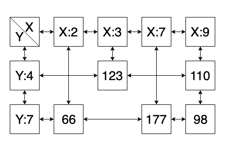
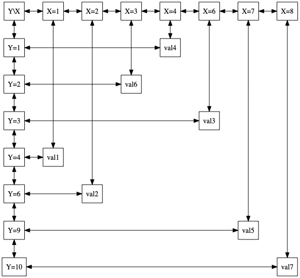

In computer science a sparse matrix y a 2-dimensional structure consisting of **rows** and **columns**, and it’s a matrix which contains many **NULL** values. In comparison to a normal 2-dimensional array matrix, a sparse matrix only creates the nodes that are needed to both keep track of the elements in the matrix (*headers*) and the nodes itself, It’s implementation is more complex than a regular matrix, and can only be achieved thru the use of *objects*. But the benefits are great in storage since we do not have useless nodes.



## Example

This example demonstrates how to build a Matrix (4-links) using

### Node class

Our Node class is the foundation on which we will build our matrix, so it is very important to define all the necessary attributes that we will use later one, in this case as an example we will only work with a parameter **data**, to store some kind of data (school id for example), but more parameters can be easily added, it is also important to note that we will begin to work with **links** or **pointers** at this time, and in our constructor we will assign the **right**, **left**, **up** and **down** pointers to None (null) because we are not building the list just yet.

``` python
class Node:
    def __init__(self,id):
        self.id = id
        self.up = None
        self.down = None
        self.left = None
        self.right = None
```

### SparseMatrix class

We will start by defining a header node that will be the foundation of our matrix, this will control both our column nodes to the right of our header node, and our line nodes to the down of our header node. We will create this node with a value with no meaning (0 is a good start) because we will only use this node to start traversing our sparse matrix.

``` python
class Matrix:
    def __init__(self):
        self.headers = Node(0)
```

### Add method

The add method is a really important part of our Sparse Matrix, we will divide it into 3 parts to make things more understandable and easier.

``` python
def add(self,x,y,value):
      self.add_x_header(x)
      self.add_y_header(y)
      self.insert_node(x,y,value)
```

#### Add x-header (if it doesn't exists)

This method adds an x-header if it doesn’t exist yet, this ensures that every time we insert a value node the headers will already exist. Since our x-headers are laid out horizontally we will use the left and right pointers to traverse this headers.

``` python
def add_x_header(self,x):
    temp = self.headers
    if temp.right == None:
        new_node = Node(x)
        temp.right = new_node
        new_node.left = temp
    else:
        while (temp.right !=None) and (temp.right.id < x):
            temp = temp.right
        if temp.right==None and temp.id !=x:
            new_node = Node(x)
            temp.right = new_node
            new_node.left = temp
        elif temp.right!=None and temp.right.id !=x:
            #temp = temp.left
            aux = temp.right
            new_node = Node(x)
            temp.right = new_node
            new_node.left = temp
            new_node.right = aux
            aux.left = new_node
```

#### Add y-header (if it doesn't exists)

This method is basically a copy of the x-header method except for the fact that it deals with the up and down pointers to add the y-headers, since this are laid up vertically, it is important to remember that these methods need to insert values in an ordered manner in order to keep the matrix integrity.

``` python
def add_y_header(self,y):
    temp = self.headers
    if temp.down == None:
        new_node = Node(y)
        temp.down = new_node
        new_node.up = temp
    else:
        while (temp.down !=None) and (temp.down.id < y):
            temp = temp.down
        if temp.down==None and temp.id !=y:
            new_node = Node(y)
            temp.down = new_node
            new_node.up = temp
        elif temp.down!=None and temp.down.id !=y:
            #temp = temp.left
            aux = temp.down
            new_node = Node(y)
            temp.down = new_node
            new_node.up = temp
            new_node.down = aux
            aux.up = new_node
```

#### Insert the node

Finally the insert_node() method look for the corresponding header in both the x-headers and y-headers and links them together thru the addition of a value node. It is important to note that here there can be a lot of situations or **cases** that can be applied, for example: What if a value node already exists between the header we are trying to link and the new value node?. For this it’s important to list out all the possible scenarios that could come up to be sure we are prepared for these cases. In this example we will be listing only the simplest case. When there is a new node in both the x and y header. But for future reference you should consider all possible scenarios.

### SparseMatrix instance

Finally we create a new instance of out SparseMatrix, add a couple of values and create our png image to check if its working correctly.

``` python
mat = Matrix()
mat.add(1,4,'val1')
mat.add(2,6,'val2')
mat.add(6,3,'val3')
mat.add(4,1,'val4')
mat.add(7,9,'val5')
mat.add(3,2,'val6')
mat.add(8,10,'val7')
```

### SparseMatrix Graph

Up until now, we usually make sure our structures are correct thru the use of a print() method to print the elements on the console, but since the matrix is a 2 dimensional array it can be quite challenging to represent on a terminal environment, because of this we will use an automated method to traverse the matrix and write a dot file so we can see our matrix thru graphviz (if you don’t know what graphviz is or how to use it, be sure to check out my post on all thing related graphviz right [here](https://dennismasaya.com/2019/08/07/Graphviz/))

#### Output

Our output should look something like this.


